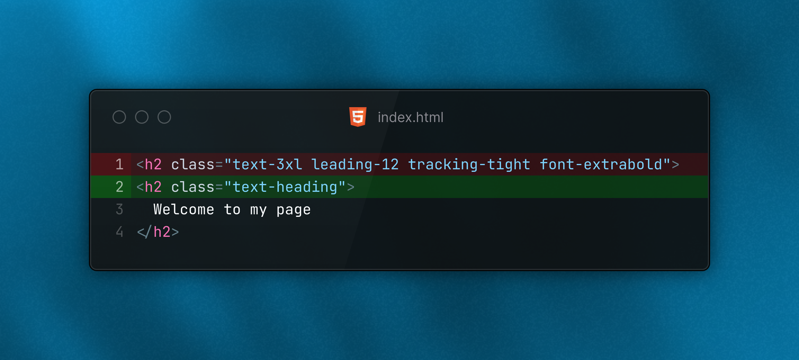

# TailwindCSS Semantic Typography

TailwindCSS Semantic Typography is a highly extendable plugin for Tailwind CSS
that add semantic text utilities for many use cases like headings, labels, code-blocks, etc.
This allows the user to define a type system and re-use these font styles later.

For example `heading` translates to the following:

```css
.text-heading {
    @apply text-3xl leading-12 tracking-tight font-extrabold color-[var(--color-content-emphasis, var(--color-black))];
}
```



**Table of content**

1. [Installation](#1-installation)
2. [Features](#2-features)
3. [Customization](#3-customization)
4. [Contributions](#4-contributions)
5. [Further information](#5-further-information)

## 1. Installation

To install the TailwindCSS Semantic Typography follow the following steps:

1. Install the TailwindCSS Semantic Typography dependency:

```bash
npm install @ilijazm/tailwindcss-semantic-typography
```

2. Import the plugin in your `.css`-file.

```diff
@import "tailwindcss";
+ @plugin "@ilijazm/tailwindcss-semantic-typography";
```

## 2. Features

### Default utilities

By default, the plugin adds the following utility classes:

| utility      | translates                                                                                                              |
|--------------|-------------------------------------------------------------------------------------------------------------------------|
| `display-1`  | `text-7xl leading-32 tracking-tighter font-normal color-[var(--color-content-emphasis var(--color-black))]`             |
| `display-2`  | `text-5xl leading-20 tracking-tighter font-normal color-[var(--color-content-emphasis var(--color-black))]`             |
| `heading`    | `text-3xl leading-12 tracking-tight font-extrabold color-[var(--color-content-emphasis var(--color-black))]`            |
| `subheading` | `text-lg leading-8 tracking-normal font-bold color-[var(--color-content-emphasis var(--color-black))]`                  |
| `lead`       | `text-xl leading-7 tracking-normal font-normal color-[var(--color-content-text-emphasis var(--color-black))]`           |
| `body`       | `text-base leading-6 tracking-normal font-normal color-[var(--color-content-text var(--color-neutral-700))]`            |
| `quote`      | `text-xl leading-7 tracking-normal font-medium color-[var(--color-content-text-muted var(--color-neutral-500))] italic` |
| `overline`   | `text-xs leading-5 tracking-widest font-bold color-[var(--color-content-emphasis var(--color-black))] uppercase`        |
| `code`       | `text-base leading-5 tracking-normal font-normal color-[var(--color-content-emphasis var(--color-black))] font-mono`    |
| `heading-1`  | `text-7xl leading-[8rem] tracking-tighter font-normal color-[var(--color-content-emphasis var(--color-black))]`         |
| `heading-2`  | `text-5xl leading-20 tracking-tighter font-normal color-[var(--color-content-emphasis var(--color-black))]`             |
| `heading-3`  | `text-4xl leading-15 tracking-tight font-semibold color-[var(--color-content-emphasis var(--color-black))]`             |
| `heading-4`  | `text-3xl leading-10 tracking-tight font-bold color-[var(--color-content-emphasis var(--color-black))]`                 |
| `heading-5`  | `text-lg leading-7 tracking-normal font-bold color-[var(--color-content-emphasis var(--color-black))]`                  |
| `heading-6`  | `text-base leading-6 tracking-normal font-black color-[var(--color-content-emphasis var(--color-black))]`               |

## 3. Customization

wip

## 4. Contributions

Contributions are welcome! Please feel free to submit a Pull Request.

### Build project

1. Install dependencies with `npm install`
1. Run `npm run build`
1. Result is in the `dist/` directory

### Run example

1. Go into the directory `example/`
1. Install dependencies with npm `install`
1. Run development build with `npm run dev`
1. Check the example via `http://localhost:5173/`

## 5. Further information

### Dependencies

```
.
└── 📦 tailwindcss
```

### License

[MIT](../LICENSE)
