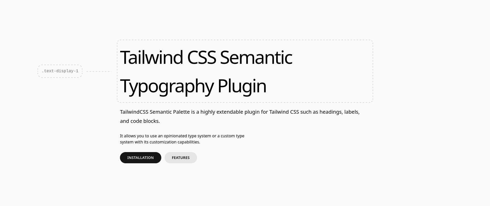
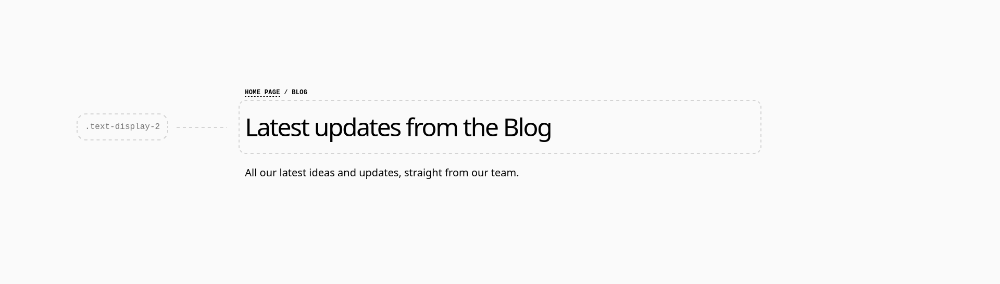

# Tailwind CSS Semantic Typography

Tailwind CSS Semantic Typography is a highly extensible plugin that adds semantic text utilities for various use cases,
such as headings, labels, and code blocks.
It allows you to use an opinionated type system or a custom type system with its customization capabilities.

For example, the utility class `text-heading` yields the following results:

```css
.text-heading {
    @apply text-3xl leading-12 tracking-tight font-medium color-[var(--color-content-emphasis, var(--color-black))];
}
```


**Table of content**

1. [Installation](#1-installation)
2. [Features](#2-features)
3. [Customization](#3-customization)
4. [Contributions](#4-contributions)
5. [Further information](#5-further-information)

## 1. Installation

To install the Tailwind CSS Semantic Typography plugin, follow these steps:

1. Install the Tailwind CSS Semantic Typography plugin dependency:

```bash
npm install @ilijazm/tailwindcss-semantic-typography
```

2. Import the plugin into your CSS file.

```diff
@import "tailwindcss";
+ @plugin "@ilijazm/tailwindcss-semantic-typography";
```

## 2. Features

The following section demonstrates the features of the Tailwind CSS Semantic Typography plugin.

### Default utilities

The Tailwind CSS Semantic Typography plugin is an opinionated tool that adds a type system to projects.
This means it comes with a set of standard utilities that serve specific **purposes**.
The following sections outline all the default utilities, their purposes, and guidelines.

#### 1. Display Layer (Page-Level Hierarchy)

Used for top-level page emphasis.

| Utility          | Purpose                                                      | Rules                 |
|------------------|--------------------------------------------------------------|-----------------------|
| `text-display-1` | Primary page title (e.g., hero headline, landing page title) | Use **once per page** |
| `text-display-2` | Secondary large title (e.g., supporting hero title)          | Use **once per page** |

##### Guidelines

* Reserved for **major structural emphasis**
* Should not appear inside article content
* Not intended for Markdown / CMS content

##### Examples

 \
_This example demonstrates how `display-1` can be used as the H1 of a hero section._

 \
_This example demonstrates how `display-2` can be used for a hero page on a subpage, such as a blog page._

#### 2. Structural Headings (Section Hierarchy)

Used for structuring page content into readable sections.

| Utility           | Purpose                                                                              |
|-------------------|--------------------------------------------------------------------------------------|
| `text-heading`    | Main section heading                                                                 |
| `text-subheading` | Secondary heading under a section                                                    |
| `text-overline`   | Small contextual label (kicker / eyebrow / meta label) that comes before the heading |

**Guidelines**

* Used in custom layouts
* Recommended for manually structured UI sections
* Do not use for Markdown-rendered content (see Rich Text section below)

#### 3. Content Typography (Readable Text)

Used inside sections for body content and emphasis.

| Utility      | Purpose                             |
|--------------|-------------------------------------|
| `text-lead`  | Introductory paragraph of a section |
| `text-body`  | Default paragraph text              |
| `text-quote` | Quoted text or testimonial blocks   |
| `text-code`  | Inline code or code blocks          |

**Guidelines**

* `text-lead` should appear at most once per section
* `text-body` is the default fallback text style
* `text-overline` is used for metadata or context labels above headings
* `text-code` ensures consistent monospace formatting

#### 4. Rich Text / Markdown Mapping

Used when styling CMS-driven or Markdown content.

These classes directly map to HTML heading tags:

| Utility          | Maps to |
|------------------|---------|
| `text-heading-1` | `h1`    |
| `text-heading-2` | `h2`    |
| `text-heading-3` | `h3`    |
| `text-heading-4` | `h4`    |
| `text-heading-5` | `h5`    |
| `text-heading-6` | `h6`    |

**Guidelines**

* Use only inside rendered Markdown / CMS content
* Do not mix with `text-display-*`
* These preserve document structure while applying design tokens

| utility class     | yielded utility classes                                                                                                 |
|-------------------|-------------------------------------------------------------------------------------------------------------------------|
| `text-display-1`  | `text-7xl leading-32 tracking-tighter font-normal color-[var(--color-content-emphasis var(--color-black))]`             |
| `text-display-2`  | `text-5xl leading-20 tracking-tighter font-normal color-[var(--color-content-emphasis var(--color-black))]`             |
| `text-heading`    | `text-3xl leading-12 tracking-tight font-medium color-[var(--color-content-emphasis var(--color-black))]`               |
| `text-subheading` | `text-lg leading-8 tracking-normal font-bold color-[var(--color-content-emphasis var(--color-black))]`                  |
| `text-lead`       | `text-xl leading-7 tracking-normal font-normal color-[var(--color-content-text-emphasis var(--color-black))]`           |
| `text-body`       | `text-base leading-6 tracking-normal font-normal color-[var(--color-content-text var(--color-neutral-700))]`            |
| `text-quote`      | `text-xl leading-7 tracking-normal font-medium color-[var(--color-content-text-muted var(--color-neutral-500))] italic` |
| `text-overline`   | `text-xs leading-5 tracking-widest font-bold color-[var(--color-content-emphasis var(--color-black))] uppercase`        |
| `text-code`       | `text-base leading-5 tracking-normal font-normal color-[var(--color-content-emphasis var(--color-black))] font-mono`    |
| `text-heading-1`  | `text-7xl leading-[8rem] tracking-tighter font-normal color-[var(--color-content-emphasis var(--color-black))]`         |
| `text-heading-2`  | `text-5xl leading-20 tracking-tighter font-normal color-[var(--color-content-emphasis var(--color-black))]`             |
| `text-heading-3`  | `text-4xl leading-15 tracking-tight font-semibold color-[var(--color-content-emphasis var(--color-black))]`             |
| `text-heading-4`  | `text-3xl leading-10 tracking-tight font-bold color-[var(--color-content-emphasis var(--color-black))]`                 |
| `text-heading-5`  | `text-lg leading-7 tracking-normal font-bold color-[var(--color-content-emphasis var(--color-black))]`                  |
| `text-heading-6`  | `text-base leading-6 tracking-normal font-black color-[var(--color-content-emphasis var(--color-black))]`               |

## 3. Customization

The **Tailwind CSS Semantic Utilities Plugin** is highly extendable.
You can add, remove and change the default settings.

### Select which text-styles to include

To select which text styles you want to include simply write them as a list with the `typography` option.

The following code demonstrates how the **Tailwind CSS Semantic Utilities Plugin** can be used
with just the "heading", "subheading", and "body" text-styles:

```css
/** Select only the "heading", "subheading", and "body" text-styles */
@plugin "@ilijazm/tailwindcss-semantic-typography" {
    "typography": "heading", "subheading", "body";
}
```

> [!NOTE]
> 
> You can also use a wildcard (`*`) to select all text-styles
> although all text styles are selected by default if you don't set any additional options.

### Customize existing text-style

To customize an existing text-style you can use the `typography--<text-style>` option.
The value of the option is defined in a _Tailwind CSS like_ classes.

The following code demonstrates how the **Tailwind CSS Semantic Utilities Plugin** can be used
with a custom "heading" style:

```css
/** Custom "heading" text style. */
@plugin "@ilijazm/tailwindcss-semantic-typography" {
    "typography--heading": "text-4xl", "leading-14", "tracking-tight", "font-extrabold", "color-black";
}
```

This uses a syntax which is similar to that of Tailwind CSS but a bit more restricted.
The following table shows all possible values:

| Style Type     | Usage                                                 | CSS-Equivalent                                | Constraints and allowed values                                                                                                                                     |
|----------------|-------------------------------------------------------|-----------------------------------------------|--------------------------------------------------------------------------------------------------------------------------------------------------------------------|
| Color          | `color-<value>`                                       | `color: var(--color-<value>)`                 | `--color-*` variables like: `red-500`, `neutral-800`, `black`, etc. as well as arbitrary values like `[var(--color-emphasis, var(--color-black))]`.                |
| Font family    | `font-<value>`                                        | `font-family: var(--font-<value>)`            |                                                                                                                                                                    |
| Font size      | `text-<value>`                                        | `font-size: var(--text-<value>)`              | `--text-*` variables like: `xs`, `sm`, `base`, `lg`, `xl`, `...`, as well as arbitrary values like: `[2.5rem]`.                                                    |
| Font style     | `italic`, `not-italic`                                | `@apply <value>` or `font-style: <value>`     | Like described. Info: `not-italic` is not a css value but rather a Tailwind CSS utility class.                                                                     |
| Font weight    | `font-<value>`                                        | `font-weight: <respected value>`              | Only these values: `thin`, `extralight`, `light`, `normal`, `medium`, `semibold`, `bold`, `extrabold`, `black`. This is because of collision with the font family. |
| Letter spacing | `tracking-<value>`                                    | `letter-spacing: var(--tracking-<value>`      | `--tracking-*` variables like: `widest`, `wide`, `normal`, `tight`, `tightest`, or any additional defined varaibles, as well as arbitrary values like `[0.5rem]`.  |
| Line height    | `leading-<value>`                                     | `line-height: calc(var(--spacing) * <value>)` | Numbers like: `1`, `2`, `...`, or arbitrary values like: `[1rem]`.                                                                                                 |
| Text transform | `uppercase`, `lowercase`, `capitalize`, `normal-case` | `@apply <value>` or `text-transform: <value>` | Like described. Info: `normal-case` is not a css value but rather a Tailwind CSS utility class.                                                                    |

> [!NOTE]
> 
> You can use a wildcard (`*`) to apply the default styles
> and to override the these.

> [!NOTE]
> 
> The order in which style rules are applies is respected
> meaning that the next style rule will override the previous one.
> 
> E.g. `"uppercase", "lowercase", "normal-case"` will result in `"normal-case"`:
> 
> ```css
> @plugin "@ilijazm/tailwindcss-semantic-typography" {
>     "typography-body": "uppercase", "lowercase", "normal-case"; /** -> "normal-case" */
> }
> ```

> [!INFO]
>
> Changed text styles do not need to be registered in the `typography` option as they are included automatically.

### Add new text style

In order to add a next text style it simply must get defined similarly to how to customize an existing style
by simply using the respected option `typography-<custom text style name>`.
The value of the option is defined in a _Tailwind CSS like_ classes.

The following code demonstrates how the **Tailwind CSS Semantic Utilities Plugin** can be used
with a custom "cta-button" style:

```css
/** Custom "cta-button" text style. */
@plugin "@ilijazm/tailwindcss-semantic-typography" {
    "typography--cta-button": "text-xl", "leading-5", "font-semibold", "color-black", "uppercase";
}
```

> [!INFO]
> 
> Custom text styles do not need to be registered in the `typography` option as they are included automatically.

## 4. Contributions

Contributions are welcome! Please feel free to submit a Pull Request.

### Build project

1. Install dependencies with `npm install`
1. Run `npm run build`
1. Result is in the `dist/` directory

### Run example

1. Go into the directory `example/`
1. Install dependencies with npm `install`
1. Run development build with `npm run dev`
1. Check the example via `http://localhost:5173/`

## 5. Further information

### Dependencies

```
.
└── 📦 tailwindcss
```

### License

[MIT](../LICENSE)
