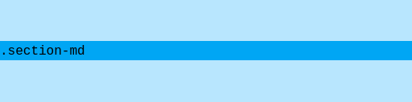
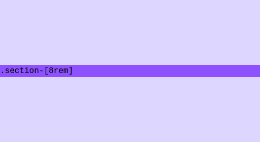

# Tailwind CSS Section

Tailwind CSS Section is a plugin for Tailwind CSS v4 that adds semantic utility classes for sections which add block padding and a relative position.

Simply use `section-md` to add padding to the top and bottom of your section and to set the position to `relative` like in this example:

```html
<section class="section-md bg-sky-200">
  <div class="bg-sky-500 font-mono">.section-md</div>
</section>
```

This yields the following result:



Additional features and examples are demonstrated in the [Features](#features) section.

This plugin depends on `@ilijazm/tailwindcss-semantic-spacings`.
More about this in the [Dependencies](#dependencies) section.

## Reason

### ⚠️ Problem Statement

It’s common to add block padding to sections.
This adds some visible distance between sections.
Often these sections have background images that need to be inside a child container with an absolute position.

### 📦 Conventional Method

Typically, you would add block padding and set the position to relative:

```html
<section class="relative py-[8rem]"></section>
```

### 🔧 Maintainability Issues

Setting the block padding using primitive values like `8rem` can lead to inconsistencies, is harder to maintenance, and lacks of clarity.

**Inconsistent**:
Mixing units like `rem`, `em`, and `px`, or using different widths in similar contexts, can break vertical alignment and lead to visually inconsistent designs.

**Hard to maintain**:
Changing all width values across a codebase is tedious unless you're using variables.

**Not expressive**:
Semantic names like `sm`, `md`, `lg` help you think in terms of intent instead of primitive numbers numbers like `4rem`, `8rem`, or `16rem`.

### 🚀 Proposed Solution

This plugin solves the previously stated problems by introducing utility classes such as `section-md`.
These classes:

- ✅ Use **semantic names** (`sm`, `md`, `lg`) instead of primitive values. \
- ✅ Set a consistent block padding. \
- ✅ Apply relative position. \

**❌ Without Tailwind CSS Section plugin:**

```html
<section class="relative py-[8rem]"></section>
```

**✅ With Tailwind CSS Section plugin:**

```html
<section class="section-md"></section>
```

## Features

### Basic example

To add block padding and set the position to relative simply use `section-md` like in this example:

```html
<section class="section-md bg-sky-200">
  <div class="bg-sky-500 font-mono">.section-md</div>
</section>
```

This yields the following result:


### Arbitrary values

You can use arbitrary values with `section-[value]`:

```html
<section class="section-[8rem] bg-violet-200">
  <div class="bg-violet-500 font-mono">.section-[8rem]</div>
</section>
```

This yields the following result:



### Classes

| Classname   | Type      |     |
| ----------- | --------- | --- |
| `section-*` | `spacing` |     |

## Variables

| Variable              | Type      | Default Value |     |
| --------------------- | --------- | ------------- | --- |
| `spacing-section-xs`  | `spacing` | `spacing-md`  |     |
| `spacing-section-sm`  | `spacing` | `spacing-lg`  |     |
| `spacing-section-md`  | `spacing` | `spacing-xl`  |     |
| `spacing-section-lg`  | `spacing` | `spacing-2xl` |     |
| `spacing-section-xl`  | `spacing` | `spacing-3xl` |     |
| `spacing-section-2xl` | `spacing` | `spacing-4xl` |     |

## Installation

```bash
npm install @ilijazm/tailwindcss-section
```

```diff
@import "tailwindcss";
+ @import "@ilijazm/tailwindcss-section";
```

## Dependencies

```
.
└── 📦 @ilijazm/tailwindcss-semantic-spacing
```

## Development

1. Clone the repository.
1. Go into the directory `tailwindcss-section/`.

```
.
└── 📁 tailwindcss-section/
    ├── 📁 example/
    └── 📁 src/
```

### Run example

1. Go into the directory `example/`
1. Install dependencies with npm `install`
1. Run development build with `npm run dev`
1. Check the example via `http://localhost:5173/`

## Contributions

Contributions are welcome! Please feel free to submit a Pull Request.

## License

[MIT](../LICENSE)
