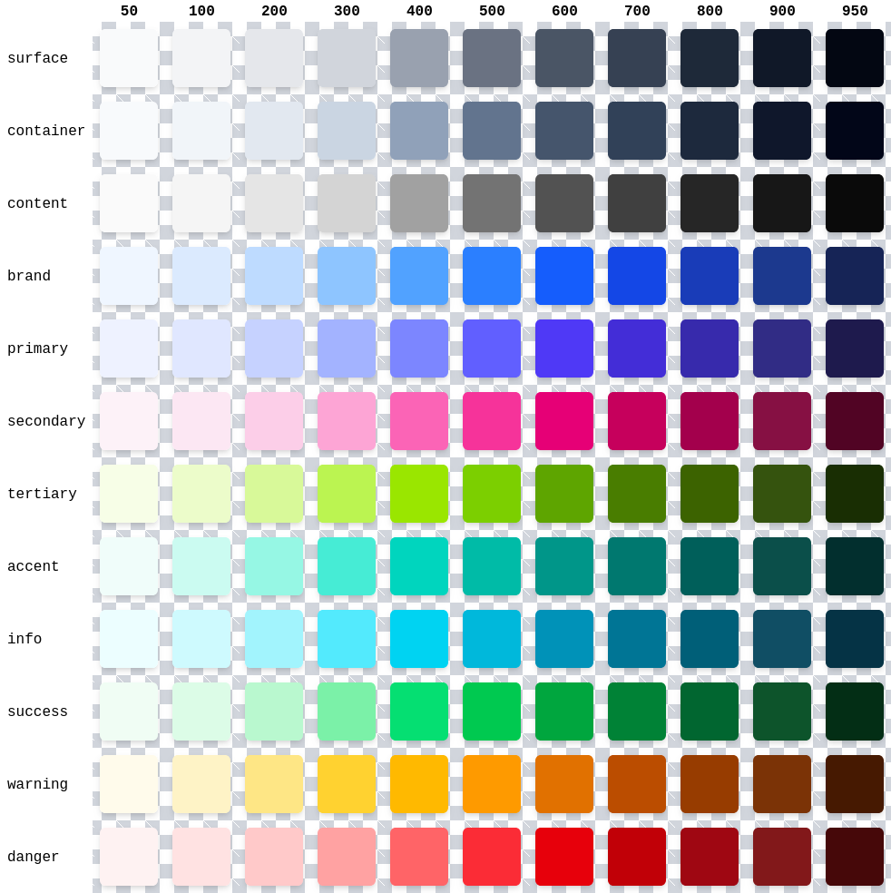
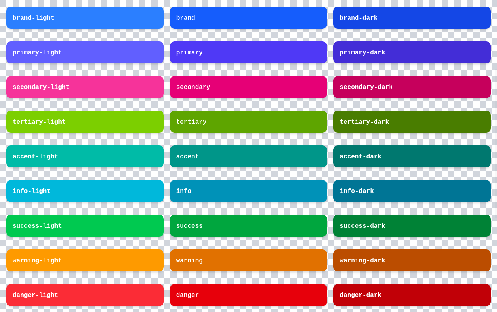
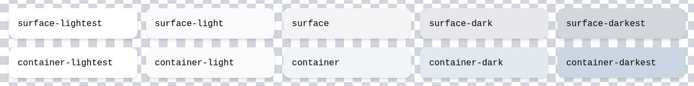
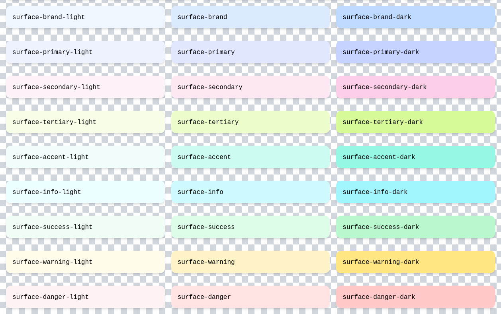
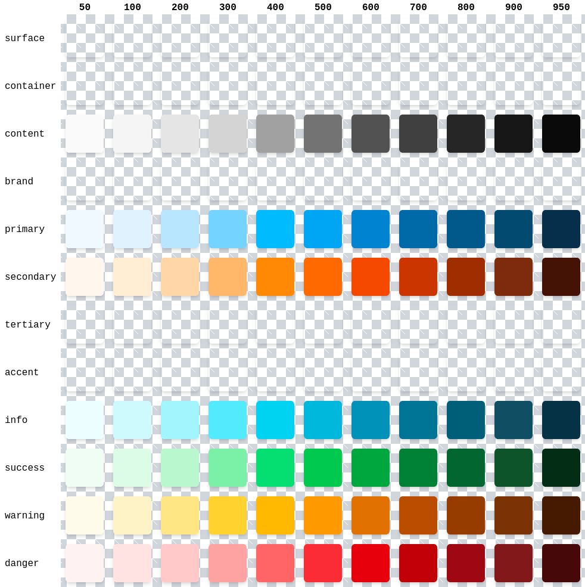

# TailwindCSS Semantic Colors

TailwindCSS Semantic Colors is a plugin for Tailwind CSS v4 that abstracts colors into semantic colors, allowing you to reference colors by their intended meaning (such as `primary`, `success`, or `warning`) instead of specific color values.

## Reason

### ⚠️ Problem Statement

Managing colors in large projects using raw color values or utility classes can lead to inconsistency, confusion, and difficulty in maintaining a unified design system. Developers often struggle to remember which color should be used for specific UI elements, resulting in accidental mismatches and increased cognitive load.

### 📦 Conventional Method

Traditionally, Tailwind CSS projects use direct color classes (e.g., `bg-blue-500`, `text-red-600`) throughout the codebase. This approach tightly couples design decisions to specific color values, making it hard to update or refactor colors globally. It also lacks semantic meaning, so the intent behind a color choice is not clear.

### 🔧 Maintainability Issues

When design requirements change, updating colors across a large codebase is tedious and error-prone. Directly using raw color values (such as `bg-blue-500` or `text-green-600`) means every instance must be manually updated, increasing the risk of missing spots and introducing inconsistencies. Over time, different developers may choose slightly different shades for similar UI elements, leading to a fragmented and inconsistent visual experience.

These color classes are also vague—they do not communicate the intended purpose or meaning behind their usage. For example, `bg-blue-500` might represent a primary action in one place and an informational message in another, making it difficult to enforce a unified design language. As a result, maintaining a consistent brand identity and user experience becomes challenging, especially as the project grows and more contributors are involved.

### 🚀 Proposed Solution

TailwindCSS Semantic Colors introduces semantic color tokens (such as `primary`, `success`, `warning`) that map to specific color values. The plugin is highly configurable, allowing you to define your own semantic tokens and extend beyond the basics. In addition to core colors, it also provides respective surface colors (like `surface-primary`, `surface-success`, `surface-warning`) for backgrounds and containers, enabling even richer semantic meaning and consistency throughout your UI. By referencing colors semantically, you can easily update color schemes, maintain consistency, and communicate design intent more clearly.

**❌ Without Tailwind CSS Semantic Colors:**

```html
<div class="bg-green-100">
  {{ container_code }}
  <span class="text-green-600">Success!</span>
</div>
```

**✅ With Tailwind CSS Semantic Colors plugin:**

```html
<div class="bg-surface-primary">
  {{ container_code }}
  <span class="text-primary-600">Success!</span>
</div>
```

This abstraction improves maintainability, scalability, and clarity in your Tailwind CSS projects.

## Features

### Default color tokens



### Default semantic colors



### Default surface colors



### Default semantic surface colors



## Customization

This yields the following result:

```css
@plugin "@ilijazm/tailwindcss-semantic-colors" {
  semantic-colors: 'primary: --color-sky-*', 'secondary: --color-orange-*', 'info', 'success', 'warning', 'danger';
  surface-colors: 'surface: slate';
}
```



## Installation

```bash
npm install @ilijazm/tailwindcss-semantic-colors
```

```diff
@import "tailwindcss";
+ @plugin "@ilijazm/tailwindcss-semantic-colors";
```

## Development

1. Clone the repository.
1. Go into the directory `tailwindcss-semantic-colors/`.

```
.
└── 📁 tailwindcss-semantic-colors/
    ├── 📁 example/
    └── 📁 src/
```

### Build project

1. Install dependencies with npm `install`
1. Run `npm run build`
1. Result is in the `dist/` directory

### Run example

1. Go into the directory `example/`
1. Install dependencies with npm `install`
1. Run development build with `npm run dev`
1. Check the example via `http://localhost:5173/`

## Roadmap

Future work includes:

- automatic dark mode
- text colors

## Contributions

Contributions are welcome! Please feel free to submit a Pull Request.

## License

[MIT](../LICENSE)
