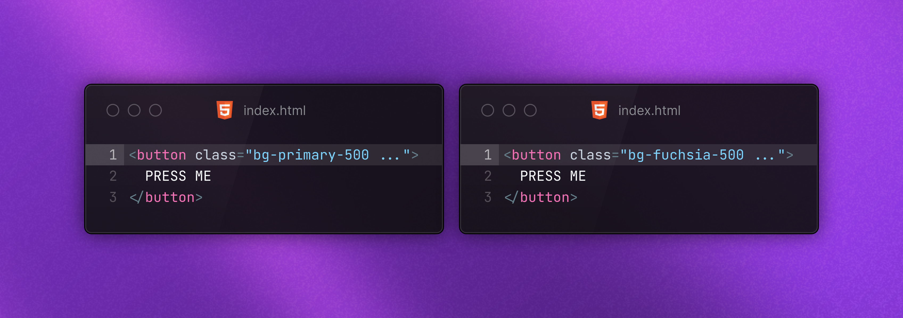
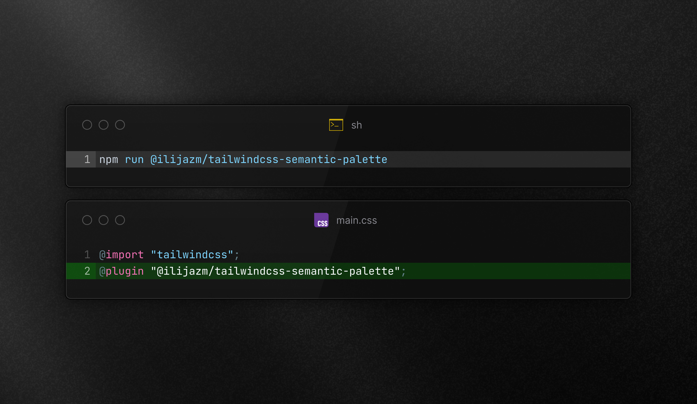
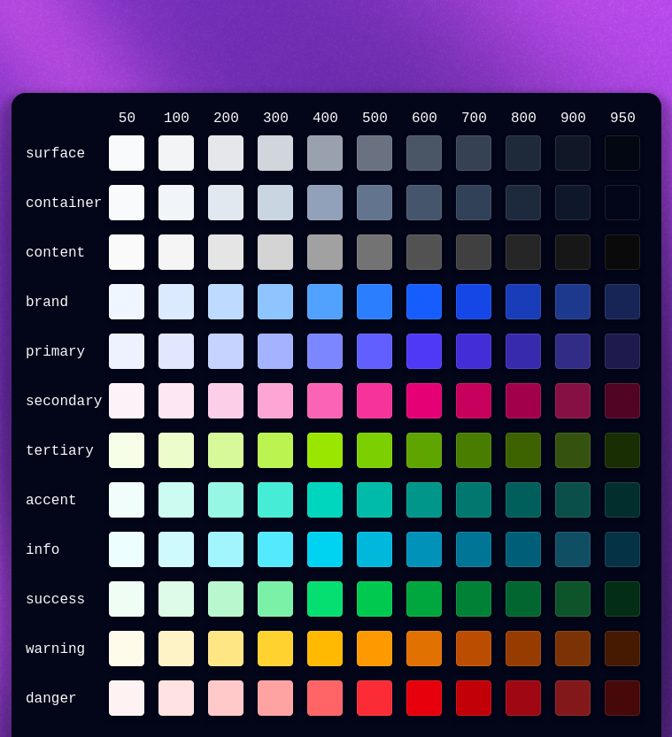
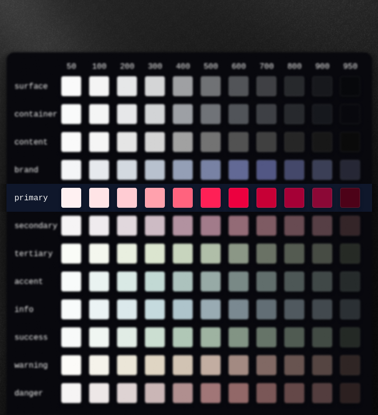

# TailwindCSS Semantic Palette

TailwindCSS Semantic Palette is a highly extendable plugin for Tailwind CSS
that extends the default color palette with colors with semantic meaning.
This allows the user to reference colors by their intended meaning such as `primary`, `success`, or `warning`
instead of specific color values such as `indigo`, `green`, or `yellow`.




**Table of content**

1. [Installation](#1-installation)
2. [Features](#2-features)
3. [Customization](#3-customization)

## 1. Installation

To install the TailwindCSS Semantic Palette follow the following steps:



1. Install the TailwindCSS Semantic Palette dependency:

```bash
npm install @ilijazm/tailwindcss-semantic-palette
```

2. Import the plugin in your `.css`-file.

```diff
@import "tailwindcss";
+ @plugin "@ilijazm/tailwindcss-semantic-palette";
```


## 2. Features

### Default palette extension

By default, the plugin adds the following colors to the TailwindCSS palette:



* `surface`
* `container`
* `content`
* `brand`
* `primary`
* `secondary`
* `tertiary`
* `accent`
* `info`
* `success`
* `warning`
* `danger`

## 3. Customization

TailwindCSS Semantic Palette is build to support a wide range of customization options:

Skip to the desired content:

* [Select a subset of colors](#select-a-subset-of-colors)
* [Customize a color](#customize-a-color)
* [Select a subset of colors and customize colors](#select-a-subset-of-colors)
* [Use custom colors exclusively](#use-custom-colors-exclusively)
* [Add custom colors to a selected subset of colors](#add-custom-colors-to-a-selected-subset-of-colors)
* [Add custom colors to all default colors](#add-custom-colors-to-all-default-colors)

### Select a subset of colors

To select only a subset of colors to add to the palette, one can use the `semantic-palette` option.
The `semantic-palette` option allows selecting a subset of colors.

Selecting a subset of colors is useful to control and limit the set of colors that gets added to the project.
For example, a user only needs to add the colors `primary` and `brand` to the palette.

The following code demonstrates how the user is able to select a subset of colors:

```css
@import 'tailwindcss';

/* Only extend the palette with the default colors for 'primary' and 'brand'. */
@plugin '@IlijazM/tailwindcss-semantic-palette' {
    semantic-palette: primary, brand;
}
```

This yields the following result:


### Customize a color

To customize a color of the palette, one can use the `semantic-palette--<color_name>` options.
The `semantic-palette--<color_name>` option allows setting the color shades of a specific color.

Customizing a color is useful to apply the proper styling and branding to a project.
For example, a user wants to set the color `primary` to `rose`.

The following code demonstrates how the user is able to set the color `primary` to `rose`:

```css
@import 'tailwindcss';

/* Extends the palette with all the default colors but set a custom primary color */
@plugin '@IlijazM/tailwindcss-semantic-palette' {
    semantic-palette--primary: "var(--color-rose-*)";
}
```

This yields the following result:




```css
@import 'tailwindcss';

/* Extends the palette with all the default colors but set a custom brand color */
@plugin '@IlijazM/tailwindcss-semantic-palette' {
    semantic-palette--brand: "#ecfbf3", "#c6f2da", "#a0eac1", "#7be1a9", "#55d990", "#2fd077", "#26aa62", "#1e844c", "#155f36", "#0d3921", "#04130b";
}
```

### Select a subset of colors and customize colors

```css
@import 'tailwindcss';

/* Only extend the palette with 'primary', 'brand', and 'warning' and customize the colors 'primary' and 'brand'. */
@plugin '@IlijazM/tailwindcss-semantic-palette' {
    semantic-palette: primary, brand, warning;
    semantic-palette--brand: "#ecfbf3", "#c6f2da", "#a0eac1", "#7be1a9", "#55d990", "#2fd077", "#26aa62", "#1e844c", "#155f36", "#0d3921", "#04130b";
}
```

### Use custom colors exclusively

```css
@import 'tailwindcss';

/* Only extend the palette with the custom colors 'to-do', 'in-progress', and 'done' */
@plugin '@IlijazM/tailwindcss-semantic-palette' {
    semantic-palette: to-do, in-progress, done;
    semantic-palette--to-do: "#ecfbf3", "#c6f2da", "#a0eac1", "#7be1a9", "#55d990", "#2fd077", "#26aa62", "#1e844c", "#155f36", "#0d3921", "#04130b";
    semantic-palette--in-progress: "var(--color-sky-*)";
    semantic-palette--done: "hsl(260, 13%, 95%)", "hsl(262, 11%, 86%)", "hsl(260, 10%, 77%)", "hsl(260, 11%, 68%)", "hsl(261, 11%, 59%)", "hsl(261, 11%, 50%)", "hsl(261, 11%, 41%)", "hsl(263, 11%, 32%)", "hsl(263, 11%, 23%)", "hsl(263, 11%, 14%)", "hsl(260, 13%, 5%)"
}
```

### Add custom colors to a selected subset of colors

```css
@import 'tailwindcss';

/* Extend the palette with colors for 'success' and 'error'
   as well as the custom colors 'to-do', 'in-progress', and 'done' */
@plugin '@IlijazM/tailwindcss-semantic-palette' {
    semantic-palette: success, error, to-do, in-progress, done;
    semantic-palette--to-do: "#ecfbf3", "#c6f2da", "#a0eac1", "#7be1a9", "#55d990", "#2fd077", "#26aa62", "#1e844c", "#155f36", "#0d3921", "#04130b";
    semantic-palette--in-progress: "var(--color-sky-*)";
    semantic-palette--done: "hsl(260, 13%, 95%)", "hsl(262, 11%, 86%)", "hsl(260, 10%, 77%)", "hsl(260, 11%, 68%)", "hsl(261, 11%, 59%)", "hsl(261, 11%, 50%)", "hsl(261, 11%, 41%)", "hsl(263, 11%, 32%)", "hsl(263, 11%, 23%)", "hsl(263, 11%, 14%)", "hsl(260, 13%, 5%)"
}
```

### Add custom colors to all default colors

```css
@import 'tailwindcss';

/* Extends the palette with all the default colors
   as well as the custom colors 'to-do', 'in-progress', and 'done' */
@plugin '@IlijazM/tailwindcss-semantic-palette' {
    semantic-palette: "*", to-do, in-progress, done;
    semantic-palette--to-do: "#ecfbf3", "#c6f2da", "#a0eac1", "#7be1a9", "#55d990", "#2fd077", "#26aa62", "#1e844c", "#155f36", "#0d3921", "#04130b";
    semantic-palette--in-progress: "var(--color-sky-*)";
    semantic-palette--done: "hsl(260, 13%, 95%)", "hsl(262, 11%, 86%)", "hsl(260, 10%, 77%)", "hsl(260, 11%, 68%)", "hsl(261, 11%, 59%)", "hsl(261, 11%, 50%)", "hsl(261, 11%, 41%)", "hsl(263, 11%, 32%)", "hsl(263, 11%, 23%)", "hsl(263, 11%, 14%)", "hsl(260, 13%, 5%)"
}
```

### Build project

1. Install dependencies with `npm install`
1. Run `npm run build`
1. Result is in the `dist/` directory

### Run example

1. Go into the directory `example/`
1. Install dependencies with npm `install`
1. Run development build with `npm run dev`
1. Check the example via `http://localhost:5173/`

## Contributions

Contributions are welcome! Please feel free to submit a Pull Request.

## License

[MIT](../LICENSE)
