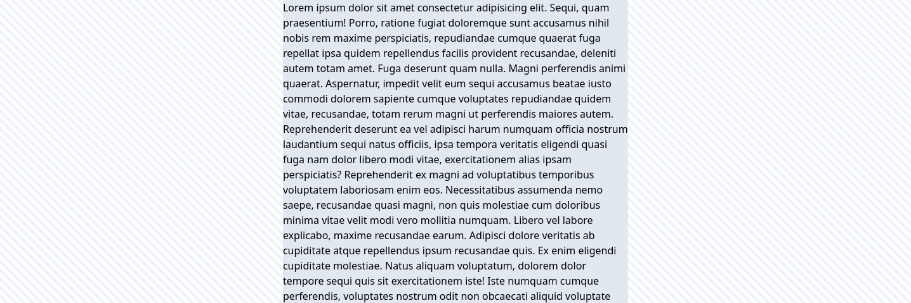
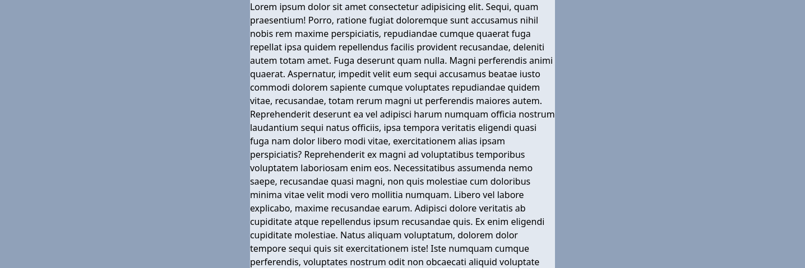
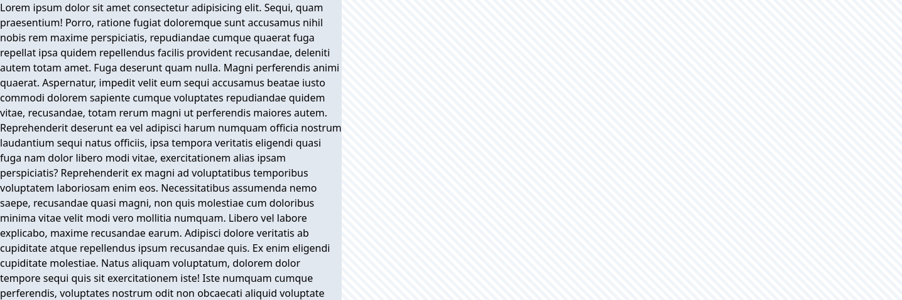

# Tailwind CSS Wrapper

Tailwind CSS Wrapper is a plugin for Tailwind CSS v4 that adds commonly used utilities for limiting content width and centering it.

Simply use `wrapper-md` to constrain the content to a readable width and center it, like in this example:

```html
<div class="wrapper-md">
  <div class="bg-slate-200">Lorem ipsum...</div>
</div>
```

This yields the following result:



Additional features and examples are demonstrated in the [Features](#features) section.

This plugin depends on `@ilijazm/tailwindcss-semantic-spacings`.
More about this in the [Dependencies](#dependencies) section.

## Reason

### ⚠️ Problem Statement

It’s common to limit content width when designing user interfaces.
This improves readability, especially for longer text.

Letting content scale with the page width is considered bad practice.

### 📦 Conventional Method

To address this, you can manually set the container width like `max-w-[24rem]`.
To center it, use `mx-auto`, and to ensure horizontal padding on smaller screens, use `px-4`.
The following example demonstrates the proposed approach:

```html
<div class="max-w-[24rem] mx-auto px-4"></div>
```

### 🔧 Maintainability Issues

Setting width using primitive values like `24rem` can lead to inconsistencies, is harder to maintenance, and lacks of clarity.

**Inconsistent**:
Mixing units like `rem`, `em`, and `px`, or using different widths in similar contexts, can break vertical alignment and lead to visually inconsistent designs.

**Hard to maintain**:
Changing all width values across a codebase is tedious unless you're using variables.

**Not expressive**:
Semantic names like `sm`, `md`, `lg` help you think in terms of intent instead of primitive numbers numbers like `24rem`, `32rem`, or `64rem`.

### 🚀 Proposed Solution

This plugin solves the previously stated problems by introducing utility classes such as `wrapper-md`.
These classes:

- ✅ Use **semantic names** (`sm`, `md`, `lg`) instead of primitive values. \
- ✅ Set a consistent width. \
- ✅ Center the container. \
- ✅ Apply default horizontal padding. \

**❌ Without Tailwind CSS Wrapper plugin:**

```html
<div class="max-w-[24rem] mx-auto px-4"></div>
```

**✅ With Tailwind CSS Wrapper plugin:**

```html
<div class="wrapper-md"></div>
```

## Features

### Basic example

To set the width and center the content, use `wrapper-md`:

```html
<div class="wrapper-md">
  <div class="bg-slate-200">Lorem ipsum...</div>
</div>
```

This yields the following result:


### Alternative approach

Instead of using the utility class `wrapper-*` you can use `wrapped-*`.
`wrapped-*` works in the same way however it uses only padding to set the width and to center the content instead of a width and margins.
The benefit with this utility class is that you can set a background color and wrap the content.

It works like in this example:

```html
<div class="bg-slate-400 wrapped-md">
  <div class="bg-slate-200">Lorem ipsum...</div>
</div>
```

This yields the following result:



**Limitations**:
`wrapped-*` does not work correctly inside another wrapped container.

**✅ Use** `wrapped-*` to apply background color across the full container width. \
**✅ Use** `wrapper-*` as the default, reliable choice. \

### Set width

To apply only the width without centering, use the `w-wrapper-*` utility:

```html
<div class="w-wrapper-md">
  <div class="bg-slate-200">Lorem ipsum...</div>
</div>
```

This yields the following result:



**✅ Use** `w-wrapper-*` when centering is not required. \
**❌ Don't use** `w-wrapper-*` in combination with `mx-auto` since this destroys the purpose of `wrapper-*`. \

### Grid

To lay out pages with sidebars, use wrapper variables in grid definitions:

```html
<div class="h-[10rem] grid grid-cols-[1fr_var(--spacing-wrapper-lg)_1fr]">
  <div class="bg-blue-600"></div>
  <div class="bg-indigo-600"></div>
  <div class="bg-violet-600"></div>
</div>
```

This yields the following result:


### Classes

| Classname   | Type      |     |
| ----------- | --------- | --- |
| `wrapper-*` | `spacing` |     |
| `wrapped-*` | `spacing` |     |

### Variables

| Variable                          | Type      | Default Value |                                                                                |
| --------------------------------- | --------- | ------------- | ------------------------------------------------------------------------------ |
| `spacing-wrapper-minimum-padding` | `spacing` | `1rem`        | The default inline padding if the wrapper exceeds the parent container's width |
| `spacing-wrapper-xs`              | `spacing` | `spacing-3xl` |                                                                                |
| `spacing-wrapper-sm`              | `spacing` | `spacing-4xl` |                                                                                |
| `spacing-wrapper-md`              | `spacing` | `spacing-5xl` |                                                                                |
| `spacing-wrapper-lg`              | `spacing` | `spacing-6xl` |                                                                                |
| `spacing-wrapper-xl`              | `spacing` | `spacing-7xl` |                                                                                |
| `spacing-wrapper-2xl`             | `spacing` | `spacing-8xl` |                                                                                |
| `spacing-wrapper-3xl`             | `spacing` | `spacing-9xl` |                                                                                |

## Installation

```bash
npm install @ilijazm/tailwindcss-wrapper
```

```diff
@import "tailwindcss";
+ @import "@ilijazm/tailwindcss-wrapper";
```

## Dependencies

```
.
└── 📦 @ilijam/tailwindcss-semantic-spacing
```

## Development

1. Clone the repository.
1. Go into the directory `tailwindcss-wrapper/`.

```
.
└── 📁 tailwindcss-wrapper/
    ├── 📁 example/
    └── 📁 src/
```

### Run example

1. Go into the directory `example/`
1. Install dependencies with npm `install`
1. Run development build with `npm run dev`
1. Check the example via `http://localhost:5173/`

## Contributions

Contributions are welcome! Please feel free to submit a Pull Request.

## License

[MIT](../LICENSE)
