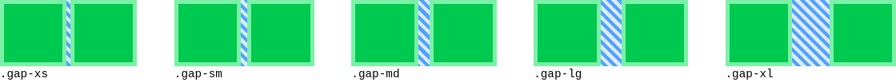
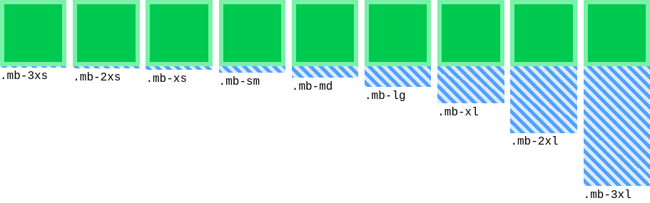

# Tailwind CSS Semantic Spacing

Tailwind CSS Semantic Spacing is a plugin for Tailwind CSS v4 that abstracts spacing values (e.g., margins, gaps, widths) from primitive tokens like `2`, `4`, `8`, etc. to semantic tokens like `sm`, `md`, `lg` etc.

## Reasons

Semantic spacing tokens offers advantages over primitive tokens:
It improves maintenance, is easier to change, and lets developer be more verbose with their designs.

## Features

The semantic spacing values can be used for widths (`w-*`), heights (`h-*`), gaps (`gap-*`), margins (`m-*`), paddings (`p-*`), and everything else that use the `--spacing-*` variable.

### Basic example

To set the width, height, and margin of a diff to `2xl` use `w-2xl`, `h-2xl`, and `mb-2xl`.

```html
<div class="striped-background bg-blue-400">
  <div class="mb-2xl w-2xl h-2xl bg-green-500 border-6 border-green-300"></div>
</div>
```

This yields the following result:


The green box represents the actual diff and the blue box represents its margin.

### Gap example

To set the gap to a semantic value use `gap-sm`, `gap-md`, `gap-lg`, etc.

```html
<div class="gap-md striped-background flex bg-blue-400">
  <div class="w-2xl h-2xl bg-green-500 border-6 border-green-300"></div>
  <div class="w-2xl h-2xl bg-green-500 border-6 border-green-300"></div>
</div>
```

This yields the following result:


The following shows further examples of gap values:



### Button example

Design a buttong with `py-sm` and `px-lg` like in this example:

```html
<div class="py-sm px-lg bg-blue-700 text-white rounded-full">PRESS ME</div>
```

This yields the following result:


### Exponential growth

The semantic spacings grow exponentially (controlled by the variable `spacing-power-basis` wich defaults to `1.8`):



### Variables

| Variable              | Type      | Default Value                       |                                                                   |
| --------------------- | --------- | ----------------------------------- | ----------------------------------------------------------------- |
| `spacing-power-basis` | `config`  | `1.8`                               | Controls the exponential growth of the spacings.                  |
| `spacing-4xs`         | `spacing` | `spacing-3xs / spacing-power-basis` |                                                                   |
| `spacing-3xs`         | `spacing` | `spacing-2xs / spacing-power-basis` |                                                                   |
| `spacing-2xs`         | `spacing` | `spacing-xs / spacing-power-basis`  |                                                                   |
| `spacing-xs`          | `spacing` | `spacing-sm / spacing-power-basis`  |                                                                   |
| `spacing-sm`          | `spacing` | `spacing-md / spacing-power-basis`  |                                                                   |
| `spacing-md`          | `spacing` | `spacing * 4`                       | Independent spacing variable. Change this to influence all other. |
| `spacing-lg`          | `spacing` | `spacing-md * spacing-power-basis`  |                                                                   |
| `spacing-xl`          | `spacing` | `spacing-lg * spacing-power-basis`  |                                                                   |
| `spacing-2xl`         | `spacing` | `spacing-xl * spacing-power-basis`  |                                                                   |
| `spacing-3xl`         | `spacing` | `spacing-2xl * spacing-power-basis` |                                                                   |
| `spacing-4xl`         | `spacing` | `spacing-3xl * spacing-power-basis` |                                                                   |
| `spacing-5xl`         | `spacing` | `spacing-4xl * spacing-power-basis` |                                                                   |
| `spacing-6xl`         | `spacing` | `spacing-5xl * spacing-power-basis` |                                                                   |
| `spacing-7xl`         | `spacing` | `spacing-6xl * spacing-power-basis` |                                                                   |
| `spacing-8xl`         | `spacing` | `spacing-7xl * spacing-power-basis` |                                                                   |

## Installation

```

npm install @ilijazm/tailwindcss-semantic-spacing

```

```diff
@import "tailwindcss";
+ @import "@ilijazm/tailwindcss-semantic-spacing";
```

## Development

1. Clone the repository.
1. Go into the directory `tailwindcss-semantic-spacing/`.

```
.
└── 📁 tailwindcss-semantic-spacing/
    ├── 📁 example/
    └── 📁 src/
```

### Run example

1. Go into the directory `example/`.
1. Install dependencies with npm `install`
1. Run development build with `npm run dev`
1. Check the example via `http://localhost:5173/`

## Contributions

Contributions are welcome! Please feel free to submit a Pull Request.

## License

[MIT](../LICENSE)
